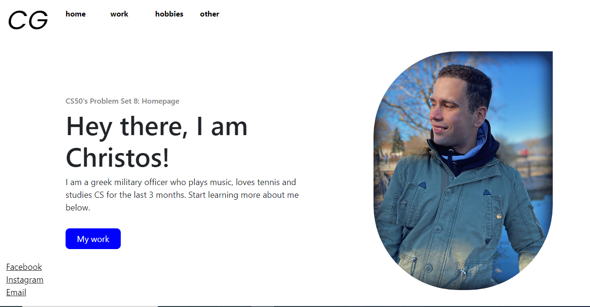

<h1 align="center">Want to learn more about me? You are in the right place 😆</h1>

GitHub pages link: 

  

    
      
    
    

## Inspiration - Purpose

This is an introductory simple 4-page website, developed with front-end technologies (HTML, CSS, JavaScript, Bootstrap) that contains basic information about my career, my interests and my future ambitions.

Its first version was used as a solution to Problem Set 8: Homepage of Harvard's CS50x 2023 and the purpose of this project was to get accustomed with these front-end technologies that the course's lectures only scratched the surface of.

Thus, the "mission accomplished" part of the project was to teach myself how to learn a new technology (JS, Bootstrap) or new things in technologies I've already used in the past (HTML, CSS).

The project's main goals are:

- To present myself in a more "Web Developer" way on GitHub as well as other platforms
  
- To practice on a project I've already created for another reason in the past (CS50x), aspects like mobile responsiveness, git and other features of the implemented technologies

## Features - Usage

The website, although completely static as it has no backend interaction, uses simple user-friendly and interactive ways to present information like:

- Revealing hidden information after submission of a form by the user (triggering an event)
  
- Organizing information in user-friendly and responsive patterns or advanced Bootstrap elements like carousel

- Presenting (in terms of UI design) the whole content of the website as a small journey, using fixed sections that apply to all pages (header, sidebar) as well as redirect buttons to the end of each page

## Development - Pages

Home

  

Work

  

Hobbies

  

Other

  

## Roadmap

- Fix some issues with the responsiveness of the website as it was not initially developed with the "mobile first" technique

## Contributing

Although it is not an ideal project for contributing, any piece of advice about making this project more good looking or implementing more intricate features to it are more than welcome 😃

## Contributors

None

## License

This project is under the default licensing policy of GitHub.  
