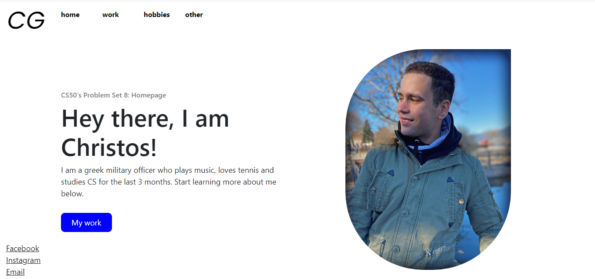
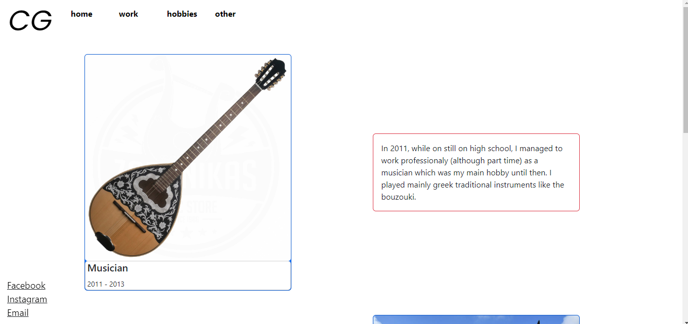
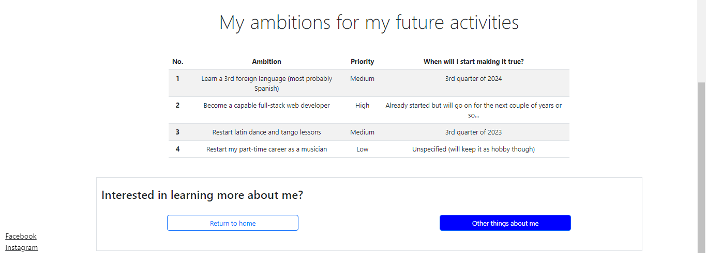
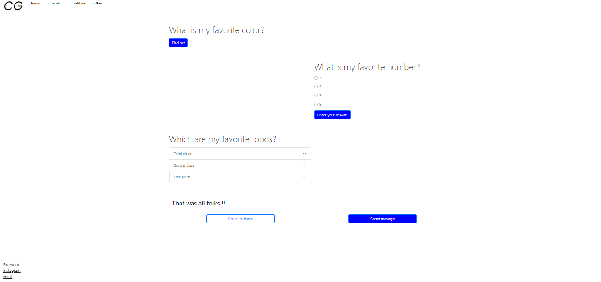

<h1 align="center">Want to learn more about me? You are in the right place 😆</h1>

GitHub pages link: 

  

    
      
    
    

## Inspiration - Purpose

This is an introductory simple 4-page website, developed with front-end technologies (HTML, CSS, JavaScript, Bootstrap) that contains basic information about my career, my interests and my future ambitions.

Its first version was used as a solution to Problem Set 8: Homepage of Harvard's CS50x 2023 and the purpose of this project was to get accustomed with these front-end technologies that the course's lectures only scratched the surface of.

Thus, the "mission accomplished" part of the project was to teach myself how to learn a new technology (JS, Bootstrap) or new things in technologies I've already used in the past (HTML, CSS).

The project's main goals are:

- To present myself in a more "Web Developer" way on GitHub as well as other platforms
  
- To practice on a project I've already created for another reason in the past (CS50x), aspects like mobile responsiveness, git and other features of the implemented technologies

## Features - Usage

The website, although completely static as it has no backend interaction, uses simple user-friendly and interactive ways to present information like:

- Revealing hidden information after submission of a form by the user (triggering an event)
  
- Organizing information in user-friendly and responsive patterns or advanced Bootstrap elements like carousel

- Presenting (in terms of UI design) the whole content of the website as a small journey, using fixed sections that apply to all pages (header, sidebar) as well as redirect buttons to the end of each page

## Development - Pages

Home

  

  

  - This page was created using only HTML and CSS. The horizontal elements (see screenshot if on mobile) are developed using CSS grid and are responsive to different screen sizes using CSS media queries.

Work

  

  

 - The structure of this page was developed using Bootstrap grid and Bootstrap card (responsive-ready) elements.

Hobbies

  

  

  

 - Bootstrap is again the protagonist of this page's structure as it is developed using its responsive headings, carousel and table components

Other

  

  

  - The Bootstrap components implemented on this page are the radio-button form, the cards and the accordion menu

  - To add some interacivity to the page (regarding the submission of the radio-button and the favorite color forms by the user) JavaScript event listeners and query selectors were used
   

## Roadmap

- Fix some issues with the responsiveness of the website as it was not initially developed with the "mobile first" technique

## Contributing

Although it is not an ideal project for contributing, any piece of advice about making this project more good looking or implementing more intricate features to it are more than welcome 😃

## Contributors

None

## License

As this project was initially created as a solution to a PSet of CS50x (although not a direct solution), is under the default licensing policy of GitHub because of CS50's academic policy. The only reasons the source code is public are the GitHub pages feature and the possibility for no-code feedback on the project.

Remember:

> When you make a creative work (which includes code), the work is under exclusive copyright by default. Unless you include a license that specifies otherwise, nobody else can copy, distribute, or modify your work without being at risk of take-downs, shake-downs, or litigation. Once the work has other contributors (each a copyright holder), “nobody” starts including you.

More info <a href="https://choosealicense.com/no-permission/">here</a> and <a href="https://opensource.guide/legal/">here</a>
